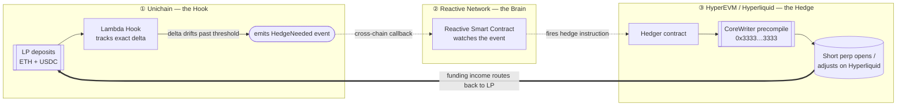

<p align="center">
  
</p>

<p align="center">
  
  &nbsp;&nbsp;
  
</p>

<p align="center">
  <b>Lambda turns the money liquidity providers quietly lose into money they earn.</b><br>
  A Uniswap v4 protocol that hedges every position on a real perpetual market — automatically, across chains.
</p>

---

## The 30-second version

If you put money into a normal Uniswap pool, you slowly lose value to professional traders. It's not a bug or a hack — it's built into how automated market makers work, and it's been measured: for an ETH pool it's roughly **11% a year**, bleeding away in the background.

Here's the trick Lambda is built on. That exact loss has a mirror image in another market. A "short" position on a perpetual futures exchange gets *paid* a fee — called funding — that, over time, is the same size as the loss the Uniswap pool suffers. Same number, opposite sign.

So Lambda holds both at once: your pool position, and a matching short that cancels its risk. The loss and the income meet in the middle. What used to leak out to arbitrageurs comes back to you as yield.

That's the whole idea. The rest of this README explains it properly — first in plain English, then with the actual math and architecture.

---

## Table of contents

- [The problem: why liquidity providers lose money](#the-problem-why-liquidity-providers-lose-money)
- [The solution: the loss is also an income stream](#the-solution-the-loss-is-also-an-income-stream)
- [How Lambda works (architecture)](#how-lambda-works-architecture)
- [The math of the hook](#the-math-of-the-hook)
- [What you actually earn](#what-you-actually-earn)
- [What makes this new](#what-makes-this-new)
- [Our sponsors — and why this work deserves their support](#our-sponsors--and-why-this-work-deserves-their-support)
- [Security](#security)
- [Status & roadmap](#status--roadmap)
- [Built with](#built-with)
- [Glossary for non-experts](#glossary-for-non-experts)
- [References](#references)
- [License](#license)

---

## The problem: why liquidity providers lose money

Let's start with no jargon.

A **liquidity provider** (LP) is someone who deposits two assets — say ETH and USDC — into a pool so other people can trade between them. In return, the LP earns a small fee on every trade. This is the engine that makes decentralized exchanges like Uniswap work.

The catch is in how the pool rebalances. When ETH's price rises, the pool automatically *sells* ETH to traders. When ETH's price falls, the pool automatically *buys* ETH. Read that again: the pool sells the thing going up and buys the thing going down. That's the opposite of what any investor would choose to do.

The people on the other side of those trades are arbitrageurs — bots that exist specifically to buy the cheap side and sell the expensive side. Every time the price moves, they take a small, certain profit from the pool. The LP pays for it.

Researchers gave this a precise name and a precise number. The 2022 paper *Automated Market Making and Loss-Versus-Rebalancing* (Milionis, Moallemi, Roughgarden, Zhang — Columbia & Microsoft Research) showed the loss rate is:

```
loss rate  =  σ² / 8        (per unit of pool value, per unit of time)
```

where **σ** (sigma) is the asset's volatility — how much its price swings around. The more an asset moves, the more the LP loses.

> **Put a number on it.** For an ETH/USDC pool with ETH moving about 5% on a typical day, that formula works out to roughly **3 basis points per day — about 11% per year** — handed silently from the LP to arbitrageurs. Trading fees often don't cover it. Many LPs are quietly underwater and don't realize it.

This loss has a technical name: **LVR** ("loss-versus-rebalancing"), the sharper cousin of the better-known "impermanent loss." It's the single biggest reason providing liquidity is harder to make money at than it looks.

---

## The solution: the loss is also an income stream

Now the part that makes Lambda worth building.

There's a second market — **perpetual futures** ("perps") — where traders bet on price without holding the asset. To keep perp prices tied to the real price, the exchange charges a continuous fee called the **funding rate**. When more people are betting long (price up), the longs pay the shorts. A short position *collects* funding.

Here is the key fact Lambda is built on:

> The funding a short position **collects** over time is, statistically, the same size as the LVR an LP **loses** over the same time. They are the same quantity with the sign flipped.

Why would that be true? Both are paid by the same underlying force — people demanding exposure to a moving price. The arbitrageur's profit against the pool and the long trader's funding payment to the short are two faces of the same coin.

So Lambda does something simple to say and careful to do well:

1. You provide liquidity through Lambda instead of providing it directly.
2. Lambda measures exactly how much price exposure your position carries.
3. It opens a matching **short perp** on [Hyperliquid](https://hyperliquid.xyz), a real on-chain perpetuals exchange, so the price risk roughly cancels out. Your position becomes close to **delta-neutral** — it barely cares which way ETH moves.
4. The short collects funding. That funding, plus your normal trading fees, is your yield. The structural loss has become structural income.

```
   Normal LP                        Lambda LP
   ─────────                        ─────────
   + trading fees                   + trading fees
   − LVR (you lose ~11%/yr)         + funding income  (you collect, instead of lose)
                                     ≈ no price risk   (delta-neutral)
   = often net negative             = target net positive
```

No new token, no leverage games, no promises that depend on a bull market. Just two positions that were always two sides of the same equation, finally held together.

---

## How Lambda works (architecture)

Lambda isn't a single contract — it's a small system spread across three places, each doing the one thing it's best at. They talk to each other automatically, with no off-chain bot or human in the loop.



**① Unichain — the hook.** This is where you interact. The Lambda hook is a [Uniswap v4 hook](https://docs.uniswap.org/contracts/v4/overview) built on OpenZeppelin's audited `BaseCustomAccounting` and `BaseOverrideFee` building blocks. It keeps the standard Uniswap trading curve untouched, but it does one extra thing: it tracks the *exact* price exposure (delta) of every position, and emits an event the moment that exposure drifts too far from neutral.

**② Reactive Network — the brain.** Watching events on one chain and acting on another usually needs a centralized server running a bot. Lambda doesn't use one. [Reactive Network](https://reactive.network) provides **Reactive Smart Contracts** — contracts that subscribe to events on other chains and trigger transactions in response, entirely on-chain. Reactive sees the hook's "hedge needed" event and decides whether to act.

**③ HyperEVM / Hyperliquid — the hedge.** When Reactive fires, a hedger contract on [HyperEVM](https://hyperliquid.gitbook.io) calls the **CoreWriter precompile** at `0x3333…3333` — a live, real system contract that lets on-chain code place real orders on Hyperliquid's perpetuals exchange. The short is opened or resized. No mock, no IOU — a real position on a real venue.

The funding that position earns is what flows back to you. The whole loop — detect drift, route across chains, adjust the hedge — runs automatically.

---

## The math of the hook

This section builds up the formulas gently. You can skim the captions and skip the equations if you like; nothing here is harder than high-school algebra plus one idea from calculus (a derivative is just "how fast something changes").

### 1. How much price risk does a position carry? (delta)

A Uniswap v4 position concentrates liquidity in a price range `[Pₐ, P_b]`. With liquidity amount `L`, the quantity of the volatile asset (ETH) the position holds at price `P` is:

```
x(P) = L · ( 1/√P − 1/√P_b )        for Pₐ ≤ P ≤ P_b
```

That quantity `x(P)` is the position's **delta** — how exposed it is to ETH's price. Most simple hedging tools approximate this with a crude shortcut (`liquidity ÷ 2`). Lambda computes the real curve above, so the hedge actually matches the position.

### 2. The hedge

Lambda opens a short of size:

```
hedge size  =  h · x(P)
```

where `h` is the **hedge ratio** (more on why it isn't 1.0 below). A short of this size moves opposite to the LP position, so the two together barely react to price — that's delta-neutral.

### 3. Don't re-hedge constantly

Adjusting the hedge costs gas and trading fees, so Lambda only acts when delta has drifted beyond a threshold `τ`:

```
re-hedge only when   | current delta − hedged delta |  >  τ
```

This keeps the position neutral without burning value on tiny, pointless adjustments.

### 4. The loss, and the identity that cancels it

The LVR loss rate from the research above:

```
LVR rate  =  σ² / 8                          (Milionis et al., 2022)
```

And the claim Lambda is built around — the LVR ⇋ funding identity:

```
E[ funding the short collects over Δt ]  ≈  E[ LVR the pool loses over Δt ]  =  (σ² / 8) · V · Δt
```

In words: over a period `Δt`, on a position worth `V`, the funding income you collect is about the same as the loss you'd otherwise eat. Hold both, scaled by the hedge ratio `h`, and the loss is routed back to you as income.

### 5. Why the hedge ratio is 0.65, not 1.0

A full hedge (`h = 1`) cancels the most price risk — but a short can be **liquidated** if the price spikes against it, which would be a disaster. The 2026 work by Hane et al. on optimal hedging under liquidation risk shows the sweet spot:

```
best hedge ratio  h*  ≈  0.65
   • h = 1.00  →  ~19% chance of liquidation over 90 days
   • h = 0.65  →  ~1.4% chance, and still removes 93–97% of impermanent loss
```

Lambda ships `h = 0.65` by default. You give up a sliver of hedging to make the position dramatically safer. That trade is worth it.

---

## What you actually earn

For an ETH/USDC position at the default `h = 0.65`, the pieces add up roughly like this:

| Where it comes from | Normal LP | Lambda LP |
|---|---:|---:|
| Trading fees | +5–12% / yr | +5–12% / yr *(curve unchanged)* |
| LVR drag | **−11% / yr** *(silent loss)* | **~+7% / yr** *(captured back)* |
| Funding income from the short | — | +10–15% / yr |
| Impermanent loss at a 2× price move | −5.7% | ≈ 0% *(93–97% neutralized)* |
| **Net target, with price risk near zero** | often negative | **≈ 18–30% / yr** |

These are modeled figures based on historical volatility and funding rates, not a guarantee — funding rates vary, and markets do what they want. The point is the *structure*: a position designed to earn whether the market goes up, down, or sideways.

---

## What makes this new

- **It treats funding as a Uniswap yield source.** As far as we know, this is the first v4 hook to turn perpetual-funding income into a native yield stream for LPs, by making the LVR ⇋ funding identity explicit and acting on it.
- **The hedge is real, and it's cross-chain, and it's automatic.** The short is a real position on Hyperliquid, opened through the live CoreWriter precompile — not a simulated stand-in. The cross-chain coordination runs on Reactive Smart Contracts with no off-chain bot.
- **The risk math is honest.** Lambda doesn't blindly fully-hedge. It uses the research-backed `h = 0.65` to keep liquidation risk near 1% instead of near 20%.
- **It stands on peer-reviewed work.** The design composes results from Milionis et al. (LVR), Chitra & Diamandis et al. (which proves venues like Hyperliquid are well-suited to delta-hedging), Hane et al. (optimal hedge ratio), and Maire & Wunsch (market-neutral LP construction). See [References](#references).

---

## Our sponsors — and why this work deserves their support

<p align="center">
  
  &nbsp;&nbsp;&nbsp;
  
</p>

###  &nbsp;Uniswap

LVR is widely considered the most important unsolved problem for Uniswap liquidity providers — it's the reason sophisticated capital hesitates to provide liquidity, and it caps how deep and competitive pools can get. Lambda is a direct, native answer to it, built the way the v4 ecosystem is meant to be extended:

- It's a **first-class v4 hook**, composed from OpenZeppelin's audited `BaseCustomAccounting` and `BaseOverrideFee` primitives, and it leaves the canonical swap curve untouched — so it adds protection without changing how the pool trades.
- It **brings new capital and a new reason to LP.** A delta-neutral, yield-positive position is exactly the product that pulls risk-averse capital into v4 pools that would otherwise sit on the sidelines.
- It's designed to be **discoverable and reusable** — packaged for submission to the Uniswap Foundation Hook Registry so other builders can compose on it.

Funding this work advances Uniswap's own most-cited open problem, with a hook other developers can build on.

###  &nbsp;Reactive Network

Lambda is close to a perfect demonstration of what Reactive Network is for. The protocol's entire promise — *react to an on-chain event and trigger a transaction on another chain, with no centralized bot* — is exactly the hard part of Lambda, and exactly what Reactive solves:

- The hedge **has to** be cross-chain (Uniswap on one chain, the perp venue on another) and **has to** be automatic (delta drifts continuously). That's the canonical Reactive use case, not a bolted-on extra.
- It pushes Reactive into a **demanding, high-value setting** — moving real money to manage real financial risk across chains — which is the kind of showcase use case that shows the network's reliability under pressure.
- It exercises Reactive **end to end**: event subscription on the Uniswap side, on-chain decision logic, and a cross-chain callback that drives a real order through HyperEVM's CoreWriter precompile.

Funding this work gives Reactive a showcase application where its cross-chain automation isn't a convenience — it's the thing that makes the product possible at all.

---

## Security

Lambda moves real value across chains, so safety is treated as a first-class design constraint, not an afterthought:

- **The trading curve is never modified.** Protection comes from dynamic fees and an off-pool hedge, so the core swap behavior LPs rely on stays standard and predictable.
- **Liquidation risk is bounded by design** — the `h = 0.65` hedge ratio keeps the short far from liquidation in normal conditions (see [the math](#the-math-of-the-hook)).
- **Cross-chain messages are authenticated** on both legs of the loop, so a hedge can only be triggered by a genuine, replay-protected event from the hook.
- **An insurance reserve** is planned to backstop the rare tail cases.
- A full security review and invariant fuzzing are part of the build plan before any mainnet deployment. Responsible-disclosure contact is in [`SECURITY.md`](./SECURITY.md).

---

## Status & roadmap

Lambda is an active build for the Uniswap Hookathon (UHI9). The research and protocol design are complete; implementation is underway.

| Stage | State |
|---|---|
| Research, math, and protocol design | ✅ Done |
| Solidity hook + delta-tracking math library | 🔨 In progress |
| Reactive Smart Contracts + HyperEVM hedger | 🔜 Next |
| Testnet → mainnet deployment + demo | 🔜 Planned |

The rails Lambda builds on are already live and were verified directly on-chain: Hyperliquid's CoreWriter precompile (`0x3333…3333` on HyperEVM), the Uniswap v4 `PoolManager` on Unichain, and the Reactive Network system contracts.

---

## Built with

- **[Uniswap v4](https://docs.uniswap.org/contracts/v4/overview)** — the hook framework and `PoolManager`
- **[OpenZeppelin Uniswap Hooks](https://github.com/OpenZeppelin/uniswap-hooks)** — `BaseCustomAccounting`, `BaseOverrideFee`
- **[Reactive Network](https://reactive.network)** — cross-chain event-driven smart contracts
- **[Hyperliquid](https://hyperliquid.xyz)** — on-chain perpetuals, accessed via the HyperEVM CoreWriter precompile and the official `hyper-evm-lib` SDK

---

## Glossary for non-experts

| Term | Plain meaning |
|---|---|
| **Liquidity provider (LP)** | Someone who deposits two assets into a pool so others can trade between them, earning a fee. |
| **AMM** | "Automated market maker" — the formula-driven pool that sets prices and executes trades without an order book. |
| **Impermanent loss / LVR** | The value an LP loses because the pool sells rising assets and buys falling ones. LVR is the precise, research-grade version of this loss. |
| **Delta** | How much a position's value moves when the price moves. "Delta-neutral" means it barely moves either way. |
| **Perpetual future (perp)** | A way to bet on an asset's price without owning it, with no expiry date. |
| **Funding rate** | A small recurring fee between perp traders that keeps the perp price tied to the real price. A short position usually collects it. |
| **Hedge** | A second position taken to cancel the risk of the first. |
| **Hook** | A plug-in that runs custom logic at key moments in a Uniswap v4 pool's life. |
| **σ (sigma) / volatility** | How much a price swings around. Higher volatility, higher LVR. |

---

## References

The protocol's design composes the following peer-reviewed and published work:

1. Milionis, Moallemi, Roughgarden, Zhang (2022). *Automated Market Making and Loss-Versus-Rebalancing.* Columbia University & Microsoft Research (ACM EC). The `σ²/8` LVR rate.
2. Chitra, Diamandis, et al. (2025). *Perpetual Demand Lending Pools.* Formalizes venues like Hyperliquid and shows they are well-suited to delta-hedging. (arXiv:2502.06028)
3. Hane et al. (2026). *Optimal hedging under perpetual liquidation risk.* The basis for the `h ≈ 0.65` hedge ratio.
4. Maire & Wunsch (2024). *Market Neutral Liquidity Provision.* LEDGER Journal (DOI 10.5195/LEDGER.2024.389). The market-neutral LP construction.
5. Cartea, Drissi, Monga. *Predictable Loss and Optimal Liquidity Provision in DeFi AMMs.* Empirical evidence that vanilla LPs trade at a loss on average.

---

## License

Code: [MIT](./LICENSE). Documentation and design content: CC-BY 4.0.

<p align="center">
  <br>
  <sub><b>Lambda</b> — the loss every LP pays, caught and turned into yield.</sub>
</p>
