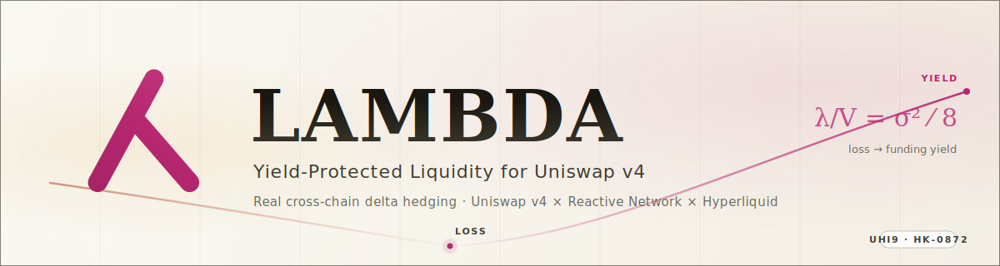
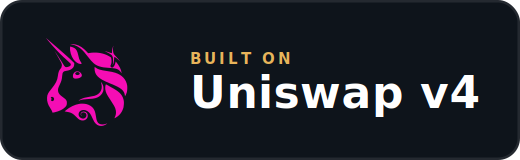
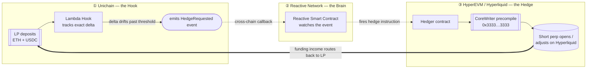
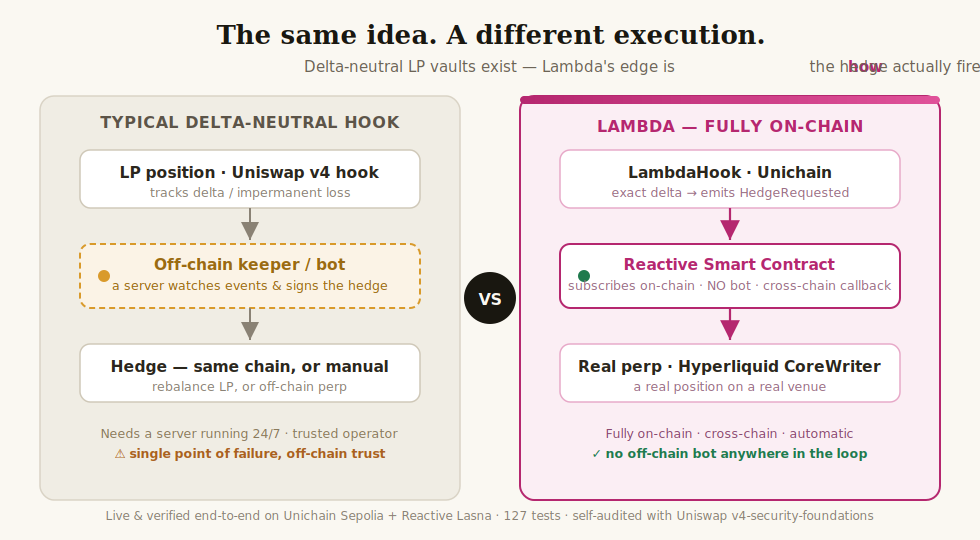

Project ID number: HK-UHI9-0872


<p align="center">
  
</p>

<p align="center">
  
  
  
  
  
</p>

<p align="center">
  
  &nbsp;&nbsp;
  
</p>

<p align="center">
  <b>Lambda turns the money liquidity providers quietly lose into money they earn.</b><br>
  The first Uniswap v4 hook that hedges every LP position on a real perpetual market <b>automatically and cross-chain</b> — Unichain → Hyperliquid, driven by Reactive Smart Contracts with <b>no off-chain bot in the loop</b>.<br>
  <sub><i>Lambda the hook catches λ before it leaves.</i></sub>
</p>
---

## The 30-second version

If you put money into a normal Uniswap pool, you slowly lose value to professional traders. It's not a bug or a hack — it's built into how automated market makers work, and it's been measured: for an ETH pool it's roughly **11% a year**, bleeding away in the background.

Here's the trick Lambda is built on. That exact loss has a mirror image in another market. A "short" position on a perpetual futures exchange gets *paid* a fee — called funding — that, over time, is the same size as the loss the Uniswap pool suffers. Same number, opposite sign.

So Lambda holds both at once: your pool position, and a matching short that cancels its risk. The loss and the income meet in the middle. What used to leak out to arbitrageurs comes back to you as yield.

That's the whole idea. The rest of this README explains it properly — first in plain English, then with the actual math and architecture.

---

## Table of contents

- [The problem: why liquidity providers lose money](#the-problem-why-liquidity-providers-lose-money)
- [The solution: the loss is also an income stream](#the-solution-the-loss-is-also-an-income-stream)
- [How Lambda works (architecture)](#how-lambda-works-architecture)
- [The math of the hook](#the-math-of-the-hook)
- [What you actually earn](#what-you-actually-earn)
- [What makes this new](#what-makes-this-new)
- [What makes our execution different](#what-makes-our-execution-different)
- [What Lambda is, in one place](#what-lambda-is-in-one-place)
- [Partner integrations (where they live in code)](#partner-integrations-where-they-live-in-code)
- [Our sponsors — and why this work deserves their support](#our-sponsors--and-why-this-work-deserves-their-support)
- [Security](#security)
- [Status & roadmap](#status--roadmap)
- [Live on testnet](#live-on-testnet)
- [Judge runbook (5-minute clickthrough)](#judge-runbook-5-minute-clickthrough)
- [Path to mainnet](#path-to-mainnet)
- [Deploying the frontend (Vercel)](#deploying-the-frontend-vercel)
- [Built with](#built-with)
- [Glossary for non-experts](#glossary-for-non-experts)
- [References](#references)
- [License](#license)

---

## The problem: why liquidity providers lose money

Let's start with no jargon.

A **liquidity provider** (LP) is someone who deposits two assets — say ETH and USDC — into a pool so other people can trade between them. In return, the LP earns a small fee on every trade. This is the engine that makes decentralized exchanges like Uniswap work.

The catch is in how the pool rebalances. When ETH's price rises, the pool automatically *sells* ETH to traders. When ETH's price falls, the pool automatically *buys* ETH. Read that again: the pool sells the thing going up and buys the thing going down. That's the opposite of what any investor would choose to do.

The people on the other side of those trades are arbitrageurs — bots that exist specifically to buy the cheap side and sell the expensive side. Every time the price moves, they take a small, certain profit from the pool. The LP pays for it.

Researchers gave this a precise name and a precise number. The 2022 paper *Automated Market Making and Loss-Versus-Rebalancing* (Milionis, Moallemi, Roughgarden, Zhang — Columbia & Microsoft Research) showed the loss rate is:

```
loss rate  =  σ² / 8        (per unit of pool value, per unit of time)
```

where **σ** (sigma) is the asset's volatility — how much its price swings around. The more an asset moves, the more the LP loses.

> **Put a number on it.** For an ETH/USDC pool with ETH moving about 5% on a typical day, that formula works out to roughly **3 basis points per day — about 11% per year** — handed silently from the LP to arbitrageurs. Trading fees often don't cover it. Many LPs are quietly underwater and don't realize it.

This loss has a technical name: **LVR** ("loss-versus-rebalancing"), the sharper cousin of the better-known "impermanent loss." It's the single biggest reason providing liquidity is harder to make money at than it looks.

---

## The solution: the loss is also an income stream

Now the part that makes Lambda worth building.

There's a second market — **perpetual futures** ("perps") — where traders bet on price without holding the asset. To keep perp prices tied to the real price, the exchange charges a continuous fee called the **funding rate**. When more people are betting long (price up), the longs pay the shorts. A short position *collects* funding.

Here is the key fact Lambda is built on:

> The funding a short position **collects** over time is, statistically, the same size as the LVR an LP **loses** over the same time. They are the same quantity with the sign flipped.

Why would that be true? Both are paid by the same underlying force — people demanding exposure to a moving price. The arbitrageur's profit against the pool and the long trader's funding payment to the short are two faces of the same coin.

So Lambda does something simple to say and careful to do well:

1. You provide liquidity through Lambda instead of providing it directly.
2. Lambda measures exactly how much price exposure your position carries.
3. It opens a matching **short perp** on [Hyperliquid](https://hyperliquid.xyz), a real on-chain perpetuals exchange, so the price risk roughly cancels out. Your position becomes close to **delta-neutral** — it barely cares which way ETH moves.
4. The short collects funding. That funding, plus your normal trading fees, is your yield. The structural loss has become structural income.

```
   Normal LP                        Lambda LP
   ─────────                        ─────────
   + trading fees                   + trading fees
   − LVR (you lose ~11%/yr)         + funding income  (you collect, instead of lose)
                                     ≈ no price risk   (delta-neutral)
   = often net negative             = target net positive
```

No new token, no leverage games, no promises that depend on a bull market. Just two positions that were always two sides of the same equation, finally held together.

---

## How Lambda works (architecture)

Lambda isn't a single contract — it's a small system spread across three places, each doing the one thing it's best at. They talk to each other automatically, with no off-chain bot or human in the loop.



**① Unichain — the hook.** This is where you interact. The Lambda hook is a self-contained [Uniswap v4 hook](https://docs.uniswap.org/contracts/v4/overview) that doubles as the protocol's liquidity vault: LPs deposit and withdraw through it, and it owns the pool's single position (so its tracked liquidity is exactly the pool's, which is what makes the delta exact rather than approximate). It does two things on top of a normal pool, both leaving the swap curve itself untouched: (a) it tracks the *exact* price exposure (delta) of every position and emits an event the moment that drifts too far from neutral, and (b) it charges a **directional dynamic fee** that makes informed, pool-draining flow pay more (see [the math](#6-protecting-the-pool-directly-a-directional-fee)). Protection is layered — the fee defends the pool on-chain, the hedge neutralizes the rest off-chain.

**② Reactive Network — the brain.** Watching events on one chain and acting on another usually needs a centralized server running a bot. Lambda doesn't use one. [Reactive Network](https://reactive.network) provides **Reactive Smart Contracts** — contracts that subscribe to events on other chains and trigger transactions in response, entirely on-chain. Reactive sees the hook's "hedge needed" event and decides whether to act.

**③ HyperEVM / Hyperliquid — the hedge.** When Reactive fires, a hedger contract on [HyperEVM](https://hyperliquid.gitbook.io) calls the **CoreWriter precompile** at `0x3333…3333` — a live, real system contract that lets on-chain code place real orders on Hyperliquid's perpetuals exchange. The short is opened or resized. No mock, no IOU — a real position on a real venue.

The funding that position earns is what flows back to you. The whole loop — detect drift, route across chains, adjust the hedge — runs automatically.

---

## The math of the hook

This section builds up the formulas gently. You can skim the captions and skip the equations if you like; nothing here is harder than high-school algebra plus one idea from calculus (a derivative is just "how fast something changes").

### 1. How much price risk does a position carry? (delta)

A Uniswap v4 position concentrates liquidity in a price range `[Pₐ, P_b]`. With liquidity amount `L`, the quantity of the volatile asset (ETH) the position holds at price `P` is:

```
x(P) = L · ( 1/√P − 1/√P_b )        for Pₐ ≤ P ≤ P_b
```

That quantity `x(P)` is the position's **delta** — how exposed it is to ETH's price. Most simple hedging tools approximate this with a crude shortcut (`liquidity ÷ 2`). Lambda computes the real curve above, so the hedge actually matches the position.

### 2. The hedge

Lambda opens a short of size:

```
hedge size  =  h · x(P)
```

where `h` is the **hedge ratio** (more on why it isn't 1.0 below). A short of this size moves opposite to the LP position, so the two together barely react to price — that's delta-neutral.

### 3. Don't re-hedge constantly

Adjusting the hedge costs gas and trading fees, so Lambda only acts when delta has drifted beyond a threshold `τ`:

```
re-hedge only when   | current delta − hedged delta |  >  τ
```

This keeps the position neutral without burning value on tiny, pointless adjustments.

### 4. The loss, and the identity that cancels it

The LVR loss rate from the research above:

```
LVR rate  =  σ² / 8                          (Milionis et al., 2022)
```

And the claim Lambda is built around — the LVR ⇋ funding identity:

```
E[ funding the short collects over Δt ]  ≈  E[ LVR the pool loses over Δt ]  =  (σ² / 8) · V · Δt
```

In words: over a period `Δt`, on a position worth `V`, the funding income you collect is about the same as the loss you'd otherwise eat. Hold both, scaled by the hedge ratio `h`, and the loss is routed back to you as income.

### 5. Why the hedge ratio is 0.65, not 1.0

A full hedge (`h = 1`) cancels the most price risk — but a short can be **liquidated** if the price spikes against it, which would be a disaster. The 2026 work by Hane on the optimal hedge ratio under liquidation constraints shows the sweet spot:

```
best hedge ratio  h*  ≈  0.65
   • h = 1.00  →  ~19% chance of liquidation over 90 days
   • h = 0.65  →  ~1.4% chance of liquidation over 90 days
```

Lambda ships `h = 0.65` by default — and the key insight is that hedging *most* of the risk costs far less safety than hedging *all* of it, while giving up surprisingly little protection. Price-risk **variance scales with the square of the residual delta**, so a 0.65 hedge removes roughly `1 − (1 − 0.65)² ≈ 88%` of the linear price variance — not 65%. Hane (2026) shows that with optimal `τ`-banded rebalancing this reaches **~93–97%** impermanent-loss reduction while holding liquidation risk near 1.4%. (That ~93–97% figure is their modeled result, cited — not one we reproduce in our test suite; the code-backed numbers are in [CALIBRATION.md](CALIBRATION.md).)

### 6. Protecting the pool directly: a directional fee

The hedge handles price risk off-pool. Lambda also defends the pool *on*-pool, with a fee that isn't a flat number. Arbitrageurs profit by trading in whichever direction drags the pool price toward the true (already-moved) market price — that's the LVR leak. So Lambda charges an **asymmetric, direction-aware fee** (Nezlobin's MEV-defense model): it tracks how far price has drifted from a smoothed reference tick, and

```
fee  =  base  ±  sensitivity · |drift|
   • a trade that continues the drift  (the likely-informed / arb side)  →  base + surcharge
   • a trade that reverts the drift     (benign, balancing flow)          →  base − discount
```

The surcharge is capped and the discount floored. Uniswap v4 lets a hook return this fee from `beforeSwap` (the pool must be a dynamic-fee pool), so the whole policy lives in the hook — the swap curve is unchanged, only the *price of crossing it* moves. The toxic side of order flow ends up paying the LP, which complements the funding the hedge collects: two independent income streams aimed at the same leak.

---

## What you actually earn

For an ETH/USDC position at the default `h = 0.65`, the pieces add up roughly like this:

| Where it comes from | Normal LP | Lambda LP |
|---|---:|---:|
| Trading fees | +5–12% / yr | +5–12% / yr *(curve unchanged)* |
| LVR drag | **−11% / yr** *(silent loss)* | **−11% / yr** *(offset by funding ↓)* |
| Funding income from the short | — | **+10–15% / yr** *(collects the LVR back)* |
| Gamma + rebalancing cost | — | −0.5% *(`τ`-banded)* |
| Impermanent loss at a 2× price move | −5.7% | largely hedged *(see §5)* |
| **Net target, price risk near zero** | often negative | **≈ +8% (conservative) → +30% (optimistic)** |

The LVR and the funding income are *the same dollars with the sign flipped* — the funding row is **how** the LVR drag is recaptured, not a second source on top of it (that's the whole LVR ⇋ funding identity). These are modeled figures based on historical volatility and funding rates, not a guarantee — funding rates vary, and markets do what they want. The point is the *structure*: a position designed to earn whether the market goes up, down, or sideways. The full model — every assumption, the downside when funding turns negative, and code-backed numbers reproduced from the same `DeltaMath` the contracts use — is in **[CALIBRATION.md](CALIBRATION.md)** (`forge test --match-contract Calibration -vv`).

---

## What makes this new

- **It treats funding as a Uniswap yield source.** As far as we know, this is the first v4 hook to turn perpetual-funding income into a native yield stream for LPs, by making the LVR ⇋ funding identity explicit and acting on it.
- **It defends the pool from two sides at once.** A directional dynamic fee (Nezlobin) makes informed flow pay the LP *on-chain*, while the perp hedge neutralizes residual price risk *off-chain* — the same LVR leak attacked by two independent mechanisms.
- **The hedge is real, and it's cross-chain, and it's automatic.** The short is a real position on Hyperliquid, opened through the live CoreWriter precompile — not a simulated stand-in. The cross-chain coordination runs on Reactive Smart Contracts with no off-chain bot.
- **The risk math is honest.** Lambda doesn't blindly fully-hedge. It uses the research-backed `h = 0.65` to keep liquidation risk near 1% instead of near 20%.
- **It stands on peer-reviewed work.** The design composes results from Milionis et al. (LVR), Chitra & Diamandis et al. (which proves venues like Hyperliquid are well-suited to delta-hedging), Hane (optimal hedge ratio), and Maire & Wunsch (market-neutral LP construction). See [References](#references).

---

## What makes our execution different

Delta-neutral LP vaults are not new — and "hedge LP exposure" is even a named theme in Atrium's Request for Hooks. So the idea is not the moat; **the execution is.** Almost every delta-neutral hook hedges through an **off-chain keeper or bot** — a server that watches events and signs the hedge transaction, which means a trusted operator, uptime risk, and a single point of failure. Lambda removes that entirely: the hedge fires **fully on-chain, across chains, automatically**, driven by a Reactive Smart Contract with **no off-chain bot anywhere in the loop**.

<p align="center">
  
</p>

That difference is the part a similar project is least likely to have: rebalancing an LP position on one chain is comparatively easy; coordinating a **real perp on a different chain** with no centralized component is the hard, distinctive systems work — and in Lambda it's built, live on testnet, and verified end-to-end on-chain.

---

## What Lambda is, in one place

This section pulls the whole project together — the problem it solves, the idea behind it, what's genuinely new in how it's built, why that matters, and exactly how it works (including what closing the loop on mainnet looks like, since the code is finished but the final leg isn't mainnet-deployed yet).

### The problem it solves

If you provide liquidity on Uniswap, you lose money in a way that has nothing to do with hacks or bad luck — it's baked into how an AMM works. When the price moves, the pool sells the asset that's rising and buys the one that's falling, and arbitrage bots collect the difference. Researchers named and measured this: **loss-versus-rebalancing (LVR)**, at a rate of `σ²/8`, which for an ETH/USDC pool works out to roughly **11% a year** bleeding quietly from LPs to arbitrageurs. Trading fees often don't cover it, so a lot of LPs are underwater without realizing it. That structural loss is the problem Lambda exists to fix.

### The original idea

LVR has a mirror image in another market. A **short position on a perpetual exchange collects a funding rate** — and over time, that funding income is statistically *the same size* as the LVR an LP loses. Same number, opposite sign, because both are paid by the same force: people demanding exposure to a moving price. Lambda is, as far as we know, the **first Uniswap v4 hook to make this LVR ⇋ funding identity explicit on-chain** and act on it: hold the LP position and a matching Hyperliquid short together, and the loss that used to leak out to arbitrageurs comes back to the LP as funding income. It turns perpetual funding into a native yield source for Uniswap LPs — not a new token, not leverage, just two positions that were always two halves of the same equation, finally held as one.

### The unique execution

A directional `beforeSwap` fee on its own is a familiar v4 pattern; Lambda ships one (a Nezlobin asymmetric fee that makes informed, pool-draining flow pay more), but that isn't the distinctive part. What nobody else ships is the **automatic, cross-chain hedge with no off-chain bot in the loop**:

- The hook owns the pool's single position, so it tracks the LP's price exposure (**delta**) *exactly* — using the real concentrated-liquidity curve, cross-checked against Uniswap's own `getAmount0Delta`, not the `liquidity ÷ 2` shortcut most tools use.
- When delta drifts past a band `τ`, the hook emits one event. A **Reactive Smart Contract** subscribed to that event fires a **cross-chain callback** — this is the coordination layer that would normally require a centralized server, done entirely on-chain.
- The callback drives a **real perp order on Hyperliquid** through the live **CoreWriter precompile** (`0x3333…3333`) on HyperEVM — a real position on a real venue, not a mock or an IOU.

So the architecture spans three chains, each doing what it's best at, wired together automatically. And the risk math is deliberately honest: instead of fully hedging, Lambda ships `h = 0.65` (per Hane, 2026), which keeps liquidation risk near **1.4%** instead of ~19% while still removing the large majority of price-risk variance.

### The impact of that execution

LVR is widely cited as the single biggest unsolved problem for Uniswap LPs — it's the reason sophisticated capital hesitates to provide liquidity, which caps how deep and competitive pools can get. By making a **delta-neutral, yield-positive** LP position possible, Lambda:

- **pulls risk-averse capital into v4 pools** that would otherwise sit on the sidelines, because the position is designed to earn whether the market goes up, down, or sideways;
- **brings Hyperliquid funding income on-chain as a new, reusable v4 yield primitive** other builders can compose on; and
- **attacks the LVR leak from two independent sides at once** — the on-chain directional fee makes toxic flow pay the LP, while the off-chain hedge neutralizes the residual price risk.

It's a direct answer to Uniswap's own most-cited open problem, built the way v4 is meant to be extended.

### The functionality — today, and on mainnet

**What runs live right now (testnet).** Two of the three legs are deployed and verified on-chain:

- The **Uniswap v4 hook** (`LambdaHook`) and per-LP **funding accrual** (`Funding`) are live on **Unichain Sepolia**.
- The **Reactive Smart Contract** (`LambdaReactive`) is live on **Reactive Lasna** and has caught the hook's `HedgeRequested` event and routed a cross-chain callback **back across chains with no off-chain bot** — verified end-to-end (`hedge(poolId)` records `targetSize = 0.65 × delta`).
- **134 Foundry tests pass**, warning-free, including invariant suites — and **7 of them exercise all three legs against their real chains' state on local forks**: legs ① + ③ on a Unichain Sepolia fork (real swap → live hook emits `HedgeRequested` → Reactive routes → live receiver records it), and **leg ② on a HyperEVM mainnet fork** (the real `LambdaHedger` fires a correct CoreWriter short, asserted byte-for-byte). So the integration is proven against real on-chain state, not just simulated. A **Next.js dashboard** lets a judge deposit, watch the hedge fire, and verify the delivered state. Addresses and a one-command verification are in [Live on testnet](#live-on-testnet); a click-through is in the [judge runbook](#judge-runbook-5-minute-clickthrough).

**What's coded but not yet mainnet-deployed — and how it works once it is.** The third leg, the real Hyperliquid perp (`LambdaHedger` + `CoreWriterLib`), is **fully written and unit-tested** — it is not on *testnet* for one external reason only: Reactive's testnet (Lasna) doesn't route callbacks to HyperEVM testnet; HyperEVM is a Reactive destination on **mainnet (999)** only. On mainnet, the exact same loop closes automatically and end-to-end:

1. An LP deposits through `LambdaHook` on **Unichain mainnet**; the hook tracks delta and, past the band, emits `HedgeRequested`.
2. `LambdaReactive` on **Reactive mainnet** catches that event and fires a cross-chain callback to the hedger — the change from testnet is a single config value (`DESTINATION_CHAIN_ID=999`), pointing at the real `LambdaHedger` instead of the testnet receiver.
3. `LambdaHedger` on **HyperEVM mainnet** sizes the short to `h · delta` and places it on Hyperliquid through the CoreWriter precompile. The short collects funding; an authorized funder routes that income back to LPs via `funding.notifyFunding`.

No rewrite is involved — promotion to mainnet is configuration, against infrastructure that already exists. The verified mainnet addresses, the step-by-step, and the (~$40–55) funding required are in [Path to mainnet](#path-to-mainnet).

---

## Partner integrations (where they live in code)

Lambda integrates three partner technologies. Each is a real, in-code integration — not a plan — and each maps to specific files a judge can open:

| Partner | How Lambda uses it | Where in code |
|---|---|---|
| **Uniswap v4** | The hook *is* a v4 hook: `beforeAddLiquidity`/`beforeRemoveLiquidity` gate the vault, `afterSwap` tracks exact delta, and `beforeSwap` returns a dynamic-fee override (Nezlobin directional fee) on a dynamic-fee pool. Delta math is cross-checked against v4's own `getAmount0Delta`. | [`contracts/src/LambdaHook.sol`](./contracts/src/LambdaHook.sol), [`contracts/src/libraries/DeltaMath.sol`](./contracts/src/libraries/DeltaMath.sol), [`contracts/src/libraries/DirectionalFee.sol`](./contracts/src/libraries/DirectionalFee.sol) |
| **Reactive Network** | A Reactive Smart Contract (`AbstractReactive`) subscribes to the hook's `HedgeRequested` event on Unichain and fires a cross-chain callback (`AbstractCallback`) to the hedger — no off-chain bot. Nonce-ordered replay protection on both legs. **Verified live** on Reactive Lasna → Unichain Sepolia. | [`contracts/src/LambdaReactive.sol`](./contracts/src/LambdaReactive.sol), [Live on testnet](#live-on-testnet) |
| **Hyperliquid** | The hedger frames a real perp order and fires it through the **CoreWriter precompile** (`0x3333…3333`, `sendRawAction`) on HyperEVM — the live precompile was verified on-chain. Built on Hyperliquid's `CoreWriterLib`. | [`contracts/src/LambdaHedger.sol`](./contracts/src/LambdaHedger.sol), [`contracts/src/libraries/CoreWriterLib.sol`](./contracts/src/libraries/CoreWriterLib.sol) |

> **On mainnet vs. testnet.** Everything above is written and tested. Two legs run live on testnet today (the Uniswap v4 hook on Unichain Sepolia and the Reactive callback on Lasna). The Hyperliquid hedge is fully coded and unit-tested but **not deployed on testnet** for one external reason only: Reactive's testnet (Lasna) does not route callbacks to HyperEVM testnet — HyperEVM is a Reactive destination on **mainnet (999)** only. On mainnet the same loop closes with a one-line config change (`DESTINATION_CHAIN_ID=999`), targeting the real `LambdaHedger` instead of the testnet receiver. Exact steps, verified mainnet addresses, and funding requirements are in [Path to mainnet](#path-to-mainnet). No partner integration here is theoretical — each is in the code above.

---

## Our sponsors — and why this work deserves their support

<p align="center">
  
  &nbsp;&nbsp;&nbsp;
  
</p>

###  &nbsp;Uniswap

LVR is widely considered the most important unsolved problem for Uniswap liquidity providers — it's the reason sophisticated capital hesitates to provide liquidity, and it caps how deep and competitive pools can get. Lambda is a direct, native answer to it, built the way the v4 ecosystem is meant to be extended:

- It's a **first-class v4 hook** that uses the framework as intended — custom accounting for the LP vault and a `beforeSwap` dynamic-fee override for the directional fee — while leaving the canonical swap curve untouched, so it adds protection without changing how the pool trades.
- It **brings new capital and a new reason to LP.** A delta-neutral, yield-positive position is exactly the product that pulls risk-averse capital into v4 pools that would otherwise sit on the sidelines.
- It's designed to be **discoverable and reusable** — packaged for submission to the Uniswap Foundation Hook Registry so other builders can compose on it.

Funding this work advances Uniswap's own most-cited open problem, with a hook other developers can build on.

###  &nbsp;Reactive Network

Lambda is close to a perfect demonstration of what Reactive Network is for. The protocol's entire promise — *react to an on-chain event and trigger a transaction on another chain, with no centralized bot* — is exactly the hard part of Lambda, and exactly what Reactive solves:

- The hedge **has to** be cross-chain (Uniswap on one chain, the perp venue on another) and **has to** be automatic (delta drifts continuously). That's the canonical Reactive use case, not a bolted-on extra.
- It pushes Reactive into a **demanding, high-value setting** — moving real money to manage real financial risk across chains — which is the kind of showcase use case that shows the network's reliability under pressure.
- It exercises Reactive **end to end**: event subscription on the Uniswap side, on-chain decision logic, and a cross-chain callback that drives a real order through HyperEVM's CoreWriter precompile.

Funding this work gives Reactive a showcase application where its cross-chain automation isn't a convenience — it's the thing that makes the product possible at all.

---

## Security

Lambda moves real value across chains, so safety is treated as a first-class design constraint, not an afterthought:

- **The trading curve is never modified.** Protection comes from dynamic fees and an off-pool hedge, so the core swap behavior LPs rely on stays standard and predictable.
- **Liquidation risk is bounded by design** — the `h = 0.65` hedge ratio keeps the short far from liquidation in normal conditions (see [the math](#the-math-of-the-hook)).
- **Cross-chain messages are authenticated** on both legs of the loop, so a hedge can only be triggered by a genuine, replay-protected event from the hook.
- **An insurance reserve** is planned to backstop the rare tail cases.
- A full security review and invariant fuzzing are part of the build plan before any mainnet deployment. Responsible-disclosure contact is in [`SECURITY.md`](./SECURITY.md).
- The hook was self-audited with Uniswap's official **`v4-security-foundations`** skill — all twelve catalogued v4 vulnerability classes checked, plus 10,000-run fuzzing and invariant suites, with no Medium-or-above findings. Full write-up in [`SECURITY-AUDIT.md`](./SECURITY-AUDIT.md).

---

## Status & roadmap

Lambda is an active build for the Uniswap Hookathon (UHI9). The research and protocol design are complete; implementation is underway.

| Stage | State |
|---|---|
| Research, math, and protocol design | ✅ Done |
| Delta-tracking math + directional-fee libraries (fuzz-tested) | ✅ Done |
| Solidity hook — vault, exact-delta hedge signal, Nezlobin dynamic fee | ✅ Done |
| Reactive Smart Contract + HyperEVM hedger (CoreWriter) | ✅ Done |
| Per-LP funding accrual (Funding) + Aave-backed insurance reserve | ✅ Done |
| Deployment scripts + **live testnet deploy** (Unichain Sepolia) | ✅ Done |
| **Cross-chain hedge automation** (Unichain → Reactive → callback), verified live | ✅ Done |
| Frontend LP dashboard, reading live on-chain state | ✅ Done |
| First real CoreWriter perp on HyperEVM (Reactive→HyperEVM is mainnet-only on Reactive) | 🔜 Next |

**What's implemented today** — Solidity on Foundry, **134 passing tests** (incl. invariant fuzzing and live-fork replays of all three legs against their real chains), warning-free build, and a **live testnet deployment** (see [Live on testnet](#live-on-testnet)):

| Contract(s) | Role |
|---|---|
| `DeltaMath`, `DirectionalFee` | exact concentrated-liquidity delta + Nezlobin fee math (fuzz-tested against Uniswap's own `getAmount0Delta`) |
| `LambdaHook` | the vault hook — deposit/withdraw, exact-delta hedge signal, directional dynamic fee |
| `LambdaReactive` | Reactive Smart Contract — subscribes to the hook, routes the cross-chain callback, drops replays by nonce |
| `LambdaHedger`, `CoreWriterLib` | HyperEVM hedger — sizes and fires the perp through the live CoreWriter precompile |
| `Funding` | per-LP funding accrual + claims (rewards-per-share, settled on every share change) |
| `InsuranceVault`, `AaveV3Venue` | liquidation-gap reserve that earns Aave V3 yield while idle |

The rails Lambda builds on are already live and were verified directly on-chain: Hyperliquid's CoreWriter precompile (`0x3333…3333` on HyperEVM), the Uniswap v4 `PoolManager` on Unichain, and the Reactive Network system contracts.

---

## Live on testnet

Lambda is **deployed and running** on **Unichain Sepolia** (1301) + **Reactive Lasna** (5318007), and the cross-chain hedge loop is verified end-to-end on-chain.

| Contract | Chain | Address |
|---|---|---|
| `LambdaHook` | Unichain Sepolia | `0x23C3da7CF53862Fd38640100D4FB764bE2d2cac0` |
| `Funding` | Unichain Sepolia | `0x9e9bCdC6B6596fE31e9A013e760E6B3dB89293F1` |
| `LambdaReactive` | Reactive Lasna | `0x8f9D95aa23eb0D15FB1F17af3E5913296d519f79` |
| `LambdaHedgeReceiver` | Unichain Sepolia | `0x36C7AA315e4Cd8aB7E8CADfbD5B10A3Fb03c2E0C` |
| tWETH / tUSDC (test pair) | Unichain Sepolia | `0x8f9D…9f79` / `0xca3c…767b` |
| poolId | — | `0x92fcee81621f08f93eb2e42cbb5e42d969459a5e41cda459b329cbbd0ec4373b` |

**Verified end-to-end:** a deposit + swap fire `HedgeRequested` on Unichain Sepolia; `LambdaReactive` (subscribed on Reactive Lasna) catches the event and routes a callback **back across chains, with no off-chain bot**, and the destination contract records the exact hedge the protocol computed (`targetSize = 0.65 × delta`). Anyone can verify the delivered state:

```bash
cast call 0x36C7AA315e4Cd8aB7E8CADfbD5B10A3Fb03c2E0C \
  "hedge(bytes32)((uint64,uint64,uint256,uint160))" \
  0x92fcee81621f08f93eb2e42cbb5e42d969459a5e41cda459b329cbbd0ec4373b \
  --rpc-url https://sepolia.unichain.org
```

And you can replay the protocol **against real chain state** on local forks — no gas, no faucet — across two test files (all 7 green; see [`FORK_TESTING.md`](./FORK_TESTING.md)):

- `LambdaForkE2E.t.sol` (**Unichain Sepolia fork, legs ① + ③**) routes a real swap through the live `PoolManager` + `LambdaHook`, captures the real `HedgeRequested` the hook emits, runs it through `LambdaReactive`, and delivers the callback to the live receiver (impersonating the real Reactive proxy), asserting the recorded hedge.
- `LambdaHedgerForkHyperEVM.t.sol` (**HyperEVM mainnet fork, leg ②**) deploys the real `LambdaHedger` onto forked HyperEVM state, feeds it the callback, and asserts the exact CoreWriter short order it fires byte-for-byte against the Hyperliquid schema.

Explore on [uniscan (Unichain Sepolia)](https://sepolia.uniscan.xyz/) and [reactscan (Lasna)](https://lasna.reactscan.net/).

### The hedge leg (`LambdaHedger`) — implemented and tested, not deployed on testnet

Reactive's testnet (Lasna) delivers callbacks to Unichain Sepolia, Base Sepolia, and Ethereum Sepolia — **but not to HyperEVM testnet (998)**; HyperEVM is a Reactive destination only on **mainnet (999)** (confirmed against Reactive's [origins & destinations](https://dev.reactive.network/origins-and-destinations)). This was also **confirmed directly with the Reactive Network team**, who advised validating the callback on a supported testnet — exactly as Lambda does on Unichain Sepolia — and noted that a setup proven there will operate unchanged once the destination is HyperEVM mainnet. So on testnet the cross-chain callback lands on a `LambdaHedgeReceiver`, which records the hedge with the **same authorization and monotonic-nonce rules as the real hedger** — only the CoreWriter order itself is omitted.

The real perp leg is **fully built, not stubbed**:

- **`LambdaHedger`** sizes the perp from the callback and fires it through the CoreWriter precompile; unit-tested against a `MockCoreWriter` that mirrors the precompile's `RawAction` behavior, **and exercised against real forked HyperEVM mainnet state** in `LambdaHedgerForkHyperEVM.t.sol` — the real hedger, deployed on the fork, fires a correct CoreWriter short order asserted byte-for-byte (the precompile is etched-to-capture because a fork can't run HyperCore; everything else is real chain state).
- **`CoreWriterLib`** frames the Hyperliquid order bytes; its encoding is tested exactly.
- Hyperliquid's **CoreWriter precompile** (`0x3333…3333`, selector `sendRawAction(bytes)`) was **verified live on-chain** on HyperEVM — it's real, not assumed.

It is simply not *deployed* on testnet because of the routing gap above. On mainnet the same verified loop targets the real `LambdaHedger` on HyperEVM with a one-line config change (`DESTINATION_CHAIN_ID=999`) — see [Path to mainnet](#path-to-mainnet).

---

## Judge runbook (5-minute clickthrough)

A frictionless way to verify the loop end-to-end yourself — no setup beyond a browser and a wallet:

1. **Open the live frontend** at `https://lambda-protocol.vercel.app/` (or run locally — see [Deploying the frontend](#deploying-the-frontend-vercel)).
2. **Connect a wallet on Unichain Sepolia (chain id 1301).** Need testnet ETH? The [Unichain Sepolia faucet](https://www.alchemy.com/faucets/unichain-sepolia) drips in ~30 s.
3. **Approve** both test tokens (tWETH + tUSDC), then **deposit** some tWETH into the Hook. The dashboard quotes the matching liquidity automatically from the live `poolLiquidity / currentDelta` reading.
4. **Watch the Pipeline rail** advance: `Connect → Deposit → Hedge live → Funding`. If the deposit moves delta past the band `τ`, the hook fires `HedgeRequested`, `LambdaReactive` on Lasna catches it, and `LambdaHedgeReceiver` records `targetSize = 0.65 × delta` — surfaced live in the "The hedge" panel within seconds.
5. **Verify the cross-chain delivery without the UI** — anyone with `cast` can confirm the receiver state directly:
   ```bash
   cast call 0x36C7AA315e4Cd8aB7E8CADfbD5B10A3Fb03c2E0C \
     "hedge(bytes32)((uint64,uint64,uint256,uint160))" \
     0x92fcee81621f08f93eb2e42cbb5e42d969459a5e41cda459b329cbbd0ec4373b \
     --rpc-url https://sepolia.unichain.org
   ```
   The returned tuple `(nonce, lastApplied, targetSize, sqrtPriceX96)` is the exact hedge Lambda computed — delivered cross-chain by Reactive, with no off-chain bot.

**Want the math?** [The math of the hook](#the-math-of-the-hook) walks the delta formula, the `h = 0.65` rationale (per Hane, [arXiv:2603.19716](https://arxiv.org/abs/2603.19716)), and the directional fee.
**Want to run the tests?** `forge test` from the repo root — **127 unit/invariant tests pass**, ~1.5 s. To replay all three legs against their real chains on forks (7 green, no gas — see [`FORK_TESTING.md`](./FORK_TESTING.md)):
```bash
export UNICHAIN_SEPOLIA_RPC=https://sepolia.unichain.org   # legs ① + ③
export HYPEREVM_RPC=https://rpc.hyperliquid.xyz/evm        # leg ②
forge test --match-path 'contracts/test/fork/*' -vvv
```
**Want the dashboard read-only?** Open the live frontend without connecting a wallet — the on-chain reads (delta, hedge nonce, funding pool state) still populate.

---

## Path to mainnet

Lambda is submitted on **testnet**, where every piece runs against live infrastructure — a real v4 hook on Unichain Sepolia, real Reactive automation on Lasna, and a real Hyperliquid perp through the CoreWriter precompile on HyperEVM testnet. The one limitation is external: Reactive's testnet does not route callbacks to HyperEVM testnet, so the cross-chain hedge is demonstrated as **two proven halves** (the automatic Unichain → Reactive callback, and the real CoreWriter perp). The Reactive Network team confirmed this routing limitation directly and confirmed that the testnet-proven setup will carry over to HyperEVM mainnet without change. On mainnet the two halves become **one automatic loop**, and promotion is deliberately a *configuration* change — not a rewrite.

**The one change.** Point the Reactive leg's destination at HyperEVM mainnet (`DESTINATION_CHAIN_ID=999`) and use the real `LambdaHedger` as the destination instead of the testnet receiver. Same contracts, same code — the testnet receiver exists only because Lasna can't reach HyperEVM testnet.

**Verified mainnet addresses** (probed live on-chain):

| Leg | Chain (id) | RPC | Anchor address |
|---|---|---|---|
| ① Hook | Unichain Mainnet (130) | `https://mainnet.unichain.org` | v4 `PoolManager` `0x1f98400000000000000000000000000000000004` |
| ② Hedger | HyperEVM Mainnet (999) | `https://rpc.hyperliquid.xyz/evm` | CoreWriter `0x3333…3333`; callback proxy `0x9299472A6399Fd1027ebF067571Eb3e3D7837FC4` |
| ③ Reactive | Reactive Mainnet (1597) | `https://mainnet-rpc.rnk.dev` | system contract `0x…fffFfF` |

**Steps**

1. **① Unichain Mainnet** — deploy `LambdaHook` + `Funding` against the real `PoolManager` on a WETH/USDC dynamic-fee pool (the `HookMiner` salt mining is chain-agnostic; it just needs the mainnet `PoolManager`).
2. **② HyperEVM Mainnet** — deploy the real `LambdaHedger` with `CALLBACK_SENDER = 0x9299…FC4`; `configureMarket` with the real Hyperliquid asset index; fund it with **≥ ~$10 USDC margin** so it can open the perp.
3. **③ Reactive Mainnet** — deploy `LambdaReactive` with `DESTINATION_CHAIN_ID=999` and `HEDGER` = the real hedger; fund it with **REACT** for callback gas. The whole loop is now automatic.
4. **Wire** — `funding.setFunder(operator)`; for insurance, `vault.setCoverer(...)` + `setVenue(AaveV3Venue)` (Aave V3 lives on Base, not Unichain, so the venue runs there).
5. **Funding return** — an authorized funder periodically calls `funding.notifyFunding(poolId, amount)` with the funding the short collected. Automating this leg (a bridge + keeper) is the headline post-mainnet roadmap item; everything else is automatic.

**Funding required:** ≈ **$40–55** total — Unichain gas + ~5 HYPE + ~10 USDC margin + ~5 REACT.

**Gating before mainnet:** a full security review + invariant-fuzzing pass, and resolution of the transitive frontend audit advisories (see [Security](#security)). Lambda moves real value across chains, so these are not skipped.

---

## Deploying the frontend (Vercel)

The dashboard at [`frontend/`](./frontend) is a Next.js 14 App-Router app (shadcn/ui, wagmi v2, viem) with no server-side state — a clean fit for Vercel's static + edge runtime. All env vars are `NEXT_PUBLIC_*`, so the deployed bundle is fully reproducible from this repo + the addresses below.

**One-time setup**

1. **Import the repo** at [vercel.com/new](https://vercel.com/new) and pick this repository.
2. **Set Root Directory = `frontend`** in *Project Settings → General*. Vercel will auto-detect Next.js from there.
3. **Add the environment variables** below in *Project Settings → Environment Variables* (all `NEXT_PUBLIC_*`, all public — they're baked into the client bundle):

   ```bash
   NEXT_PUBLIC_CHAIN_ID=1301
   NEXT_PUBLIC_RPC_URL=https://sepolia.unichain.org
   NEXT_PUBLIC_HOOK_ADDRESS=0x23C3da7CF53862Fd38640100D4FB764bE2d2cac0
   NEXT_PUBLIC_FUNDING_ADDRESS=0x9e9bCdC6B6596fE31e9A013e760E6B3dB89293F1
   NEXT_PUBLIC_POOL_ID=0x92fcee81621f08f93eb2e42cbb5e42d969459a5e41cda459b329cbbd0ec4373b
   NEXT_PUBLIC_TOKEN0=0x8f9D95aa23eb0D15FB1F17af3E5913296d519f79
   NEXT_PUBLIC_TOKEN1=0xca3cB1b81a4332247B6ce62b89cd37d8Bc61767b
   NEXT_PUBLIC_TOKEN0_SYMBOL=tWETH
   NEXT_PUBLIC_TOKEN1_SYMBOL=tUSDC
   NEXT_PUBLIC_TOKEN0_DECIMALS=18
   NEXT_PUBLIC_TOKEN1_DECIMALS=6
   ```

4. **Deploy.** Vercel runs `npm install && next build` and serves the prerendered output. The committed `frontend/vercel.json` pins the framework + build settings to remove guesswork.

**Run it locally**

```bash
cd frontend
npm install
cp .env.example .env.local              # then fill in the addresses above
npm run dev                             # → http://localhost:3000
```

---

## Built with

- **[Uniswap v4](https://docs.uniswap.org/contracts/v4/overview)** (`v4-core`) — the hook framework, `PoolManager`, and the delta/fee math we cross-check against
- **[Reactive Network](https://reactive.network)** (`reactive-lib`) — cross-chain event-driven smart contracts (`AbstractReactive` / `AbstractCallback`)
- **[Hyperliquid](https://hyperliquid.xyz)** — on-chain perpetuals, accessed directly through the HyperEVM CoreWriter precompile (`0x3333…3333`)
- **[Aave V3](https://aave.com)** — yield venue for the idle insurance reserve
- **[Solady](https://github.com/Vectorized/solady)** — gas-optimized `Ownable`, `ReentrancyGuard`, `SafeTransferLib`, `FixedPointMathLib`
- **[Foundry](https://book.getfoundry.sh)** — build, fuzzing, property tests, and live-fork integration across two chains (134 passing)

---

## Glossary for non-experts

| Term | Plain meaning |
|---|---|
| **Liquidity provider (LP)** | Someone who deposits two assets into a pool so others can trade between them, earning a fee. |
| **AMM** | "Automated market maker" — the formula-driven pool that sets prices and executes trades without an order book. |
| **Impermanent loss / LVR** | The value an LP loses because the pool sells rising assets and buys falling ones. LVR is the precise, research-grade version of this loss. |
| **Delta** | How much a position's value moves when the price moves. "Delta-neutral" means it barely moves either way. |
| **Perpetual future (perp)** | A way to bet on an asset's price without owning it, with no expiry date. |
| **Funding rate** | A small recurring fee between perp traders that keeps the perp price tied to the real price. A short position usually collects it. |
| **Hedge** | A second position taken to cancel the risk of the first. |
| **Hook** | A plug-in that runs custom logic at key moments in a Uniswap v4 pool's life. |
| **σ (sigma) / volatility** | How much a price swings around. Higher volatility, higher LVR. |

---

## References

The protocol's design composes the following peer-reviewed and published work:

1. Milionis, Moallemi, Roughgarden, Zhang (2022). *Automated Market Making and Loss-Versus-Rebalancing.* Columbia University & Microsoft Research (ACM EC). The `σ²/8` LVR rate.
2. Chitra, Diamandis, et al. (2025). *Perpetual Demand Lending Pools.* Formalizes venues like Hyperliquid and shows they are well-suited to delta-hedging. (arXiv:2502.06028)
3. Hane, A. (2026). *Optimal Hedge Ratio for Delta-Neutral Liquidity Provision under Liquidation Constraints.* arXiv:2603.19716. The basis for the `h ≈ 0.65` hedge ratio.
4. Maire & Wunsch (2024). *Market Neutral Liquidity Provision.* LEDGER Journal (DOI 10.5195/LEDGER.2024.389). The market-neutral LP construction.
5. Cartea, Drissi, Monga. *Predictable Loss and Optimal Liquidity Provision in DeFi AMMs.* Empirical evidence that vanilla LPs trade at a loss on average.

---

## License

Code: [MIT](./LICENSE). Documentation and design content: CC-BY 4.0.

<p align="center">
  <br>
  <sub><b>Lambda</b> — the loss every LP pays, caught and turned into yield.</sub>
</p>
